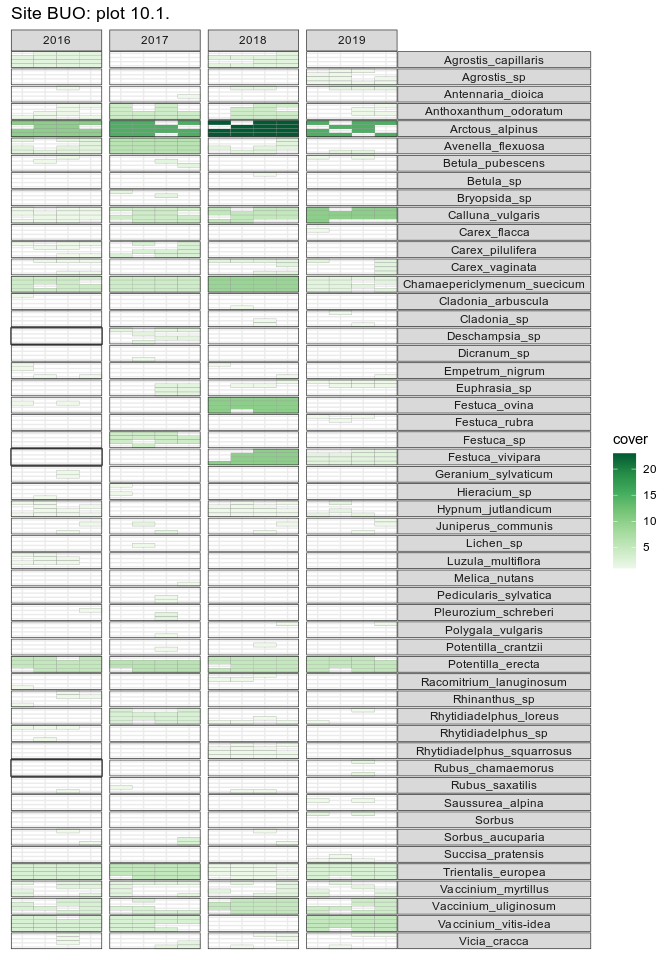

<!-- README.md is generated from README.Rmd. Please edit that file -->

# turfmapper

<!-- badges: start -->
<!-- badges: end -->

The goal of turfmapper is to plot species \* time turf maps.

## Installation

You can install `turfmapper` from [GitHub](https://github.com/) with:

``` r
# install.packages("remotes")
remotes::install_github("Between-the-Fjords/turfmapper")
```

## Example

This is a basic example which shows you how to solve a common problem:

``` r
library(turfmapper)
library("tidyverse")

data(heath)
heath_long <- heath |> 
  pivot_longer(cols = matches("^freq\\d+$"), 
               names_to = "subturf", 
               values_to = "presence", 
               names_prefix = "freq", 
               names_transform = list(subturf = as.integer)) |> 
  filter(presence != "0")#only want presences

#set up subturf grid
grid <- make_grid(ncol = 4)
```

This function will plot the data from one turf over time.

``` r
heath_long |>
  filter(plot == "10.1.") |>
  (\(x){ 
    make_turf_plot(
      data = x,
      year = year, species = species, cover = cover, subturf = subturf, 
      title = glue::glue("Site {x$site}: plot {x$plot}"), 
      grid_long = grid)
  })()
```



There are a few taxa than need checking here.

See the vignette for plotting multiple turfs.
