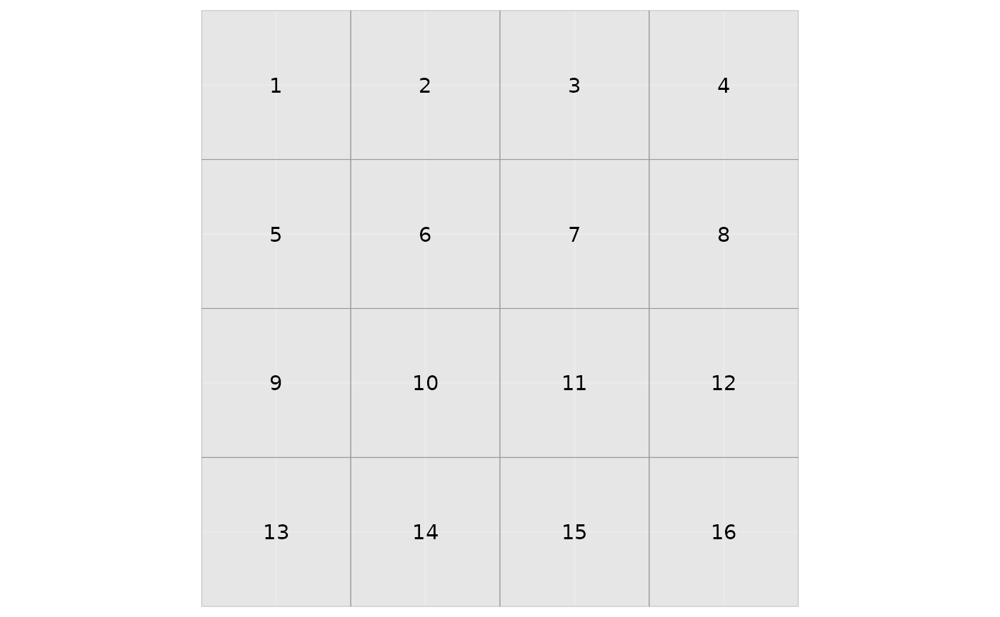
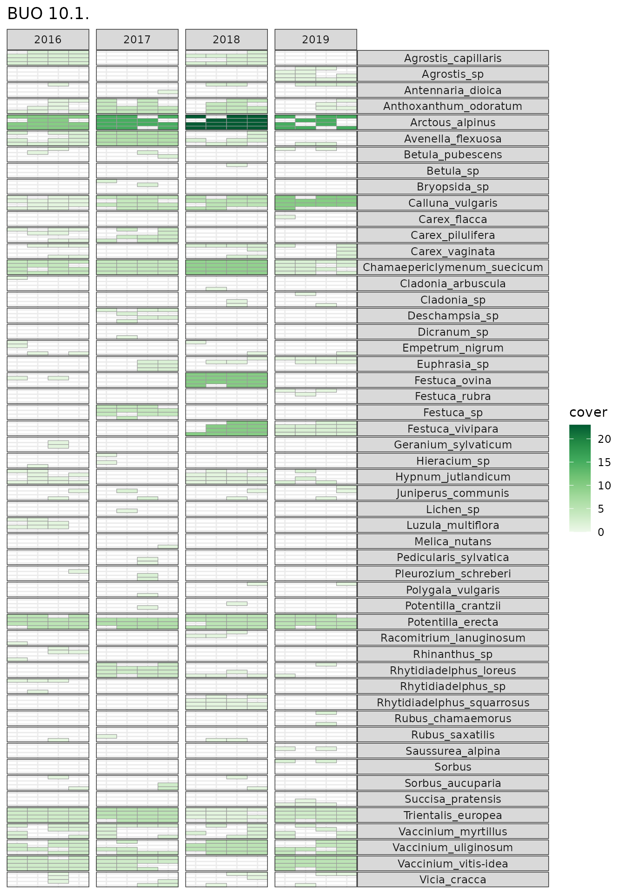
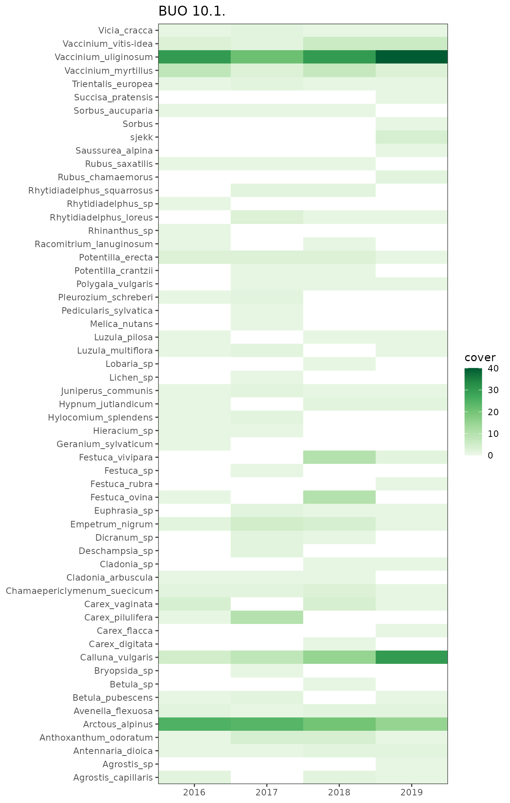
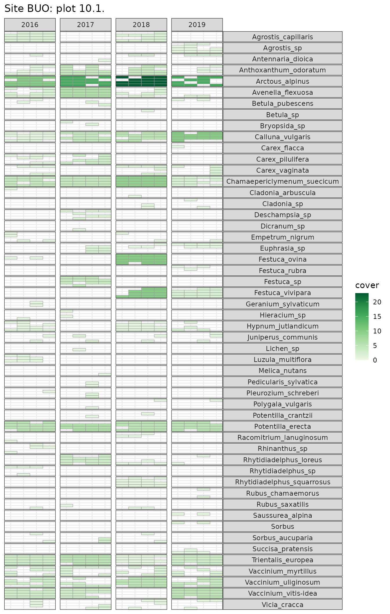
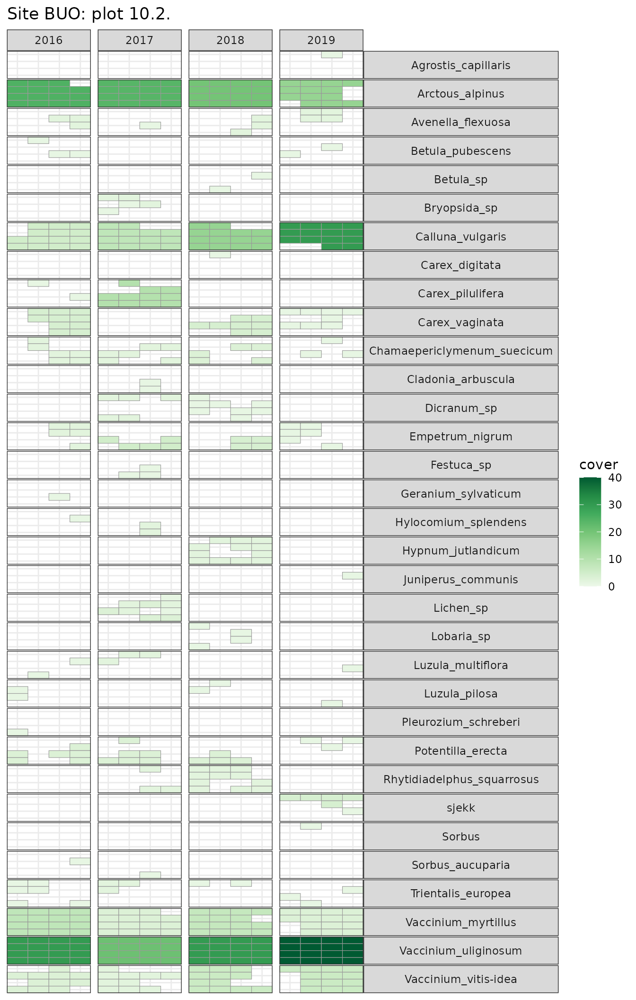

# Making turf maps

The Between the Fjords research group has several projects that
repeatedly survey the vegetation composition of plots over several
years. In any such dataset there are inevitably problems, such as
synonynms, mis-identifications (sterile *Carex* are a particular
problem), or accidental omissions.


We need to be able to identify these problems so we can try to correct
them, but with over two hundred plots surveyed four or five times, each
with about 20 taxa, it is a huge job.

To make the task easier, we developed turf-maps that plot each taxon per
turf per year. Since other people probably have similar data, and would
find our code useful, I’m going to show how we do it using some data
from the [LandPress
project](https://www.uib.no/en/rg/EECRG/95156/landpress) which studies
how climate and land-use change affects biodiversity and natural
resources in Norwegian coastal heathlands.

``` r
# load packages
library("turfmapper")
library("dplyr")
library("tidyr")
library("purrr")
```

For each 1m² turf, vegetation cover is estimated on a percent scale, and
presence/absence is recorded on a 4 x 4 sub-turf grid and reported in
columns freq1–freq16. A sample of the data is included in the package

``` r
data(heath)

heath |>
  head() |>
  select(site:freq5) |>
  knitr::kable()
```

| site | year | plot  | species              | cover | freq1 | freq2 | freq3 | freq4 | freq5 |
|:-----|-----:|:------|:---------------------|------:|:------|:------|:------|:------|:------|
| BUO  | 2016 | 10.1. | Calluna_vulgaris     |     1 | 1     | 0     | 1     | 1     | 1     |
| BUO  | 2016 | 10.1. | Arctous_alpinus      |    10 | 1     | 1     | 1     | 1     | 0     |
| BUO  | 2016 | 10.1. | Trientalis_europea   |     3 | 1     | 1     | 1     | 1     | 1     |
| BUO  | 2016 | 10.1. | Avenella_flexuosa    |     2 | 1     | 0     | 1     | 1     | 0     |
| BUO  | 2016 | 10.1. | Vaccinium_vitis-idea |     3 | 1     | 1     | 0     | 1     | 1     |
| BUO  | 2016 | 10.1. | Potentilla_erecta    |     5 | 1     | 1     | 0     | 1     | 1     |

We need to reformat the data with
[`tidyr::pivot_longer()`](https://tidyr.tidyverse.org/reference/pivot_longer.html)
to make put it into a long format suitable for plotting (see [this
post](https://www.fromthebottomoftheheap.net/2019/10/25/pivoting-tidily/))
for more about
[`pivot_longer()`](https://tidyr.tidyverse.org/reference/pivot_longer.html)).

``` r
heath_long <- heath |>
  pivot_longer(
    cols = matches("^freq\\d+$"), # subplot presence-absence columns
    names_to = "subturf",
    values_to = "presence",
    names_prefix = "freq",
    names_transform = list(subturf = as.integer)
  ) |>
  filter(presence != "0") # only want presences

# first few columns
heath_long |>
  head() |>
  knitr::kable()
```

| site | year | plot  | species          | cover | subturf | presence |
|:-----|-----:|:------|:-----------------|------:|--------:|:---------|
| BUO  | 2016 | 10.1. | Calluna_vulgaris |     1 |       1 | 1        |
| BUO  | 2016 | 10.1. | Calluna_vulgaris |     1 |       3 | 1        |
| BUO  | 2016 | 10.1. | Calluna_vulgaris |     1 |       4 | 1        |
| BUO  | 2016 | 10.1. | Calluna_vulgaris |     1 |       5 | 1        |
| BUO  | 2016 | 10.1. | Calluna_vulgaris |     1 |       6 | 1        |
| BUO  | 2016 | 10.1. | Calluna_vulgaris |     1 |       7 | 1        |

The subturfs are counted from top-left of the turf like the words on a
page. We need to map these onto row/column positions so we can plot them
with
[`make_grid()`](https://between-the-fjords.github.io/turfmapper/reference/make_grid.md).

``` r
grid <- make_grid(ncol = 4)
plot_subturf_grid(grid_long = grid)
```



[`make_turf_plot()`](https://between-the-fjords.github.io/turfmapper/reference/make_turf_plot.md)
will plot the data from one turf over time. It is wrapped in an
anonymous function so that the site and plot name can be added as a
title.

``` r
heath_long |>
  filter(plot == "10.1.") |>
  make_turf_plot(
    data = _,
    year = year, species = species, cover = cover, subturf = subturf,
    grid_long = grid,
    site_id = site,
    turf_id = plot
  )
```



There are a few things than need checking here, for example, *Agrostis
capillaris* vs. *Agrostis sp*, *Festuca*, and *Rhytidiadelphus*.

## No subturf data?

If there are no subturf data, you can still use `make_turf_plot`. We
just don’t set the `subturf` and `grid_long` arguments.

``` r

make_turf_plot(
  data = heath,
  year = year,
  species = species,
  cover = cover,
  site_id = site,
  turf_id = plot
)
```



## Multiple Subturf maps

There are lots of turfs, and I want to be able to print them all at once
which I can do using
[`purrr::pmap()`](https://purrr.tidyverse.org/reference/pmap.html) to
iterate over the data using
[`make_turf_plot()`](https://between-the-fjords.github.io/turfmapper/reference/make_turf_plot.md).

``` r
x <- heath_long |>
  # sort
  arrange(site, plot) |>
  group_by(site, plot) |>
  nest() |>
  pmap(.f = \(site, plot, data){
    make_turf_plot(
      data = data,
      year = year, species = species, cover = cover, subturf = subturf,
      title = glue::glue("Site {site}: plot {plot}"),
      grid_long = grid
    )
  }) |>
  walk(print) # print all maps
```



If the plots aren’t large enough, change `fig.height` in the chunk
options.
